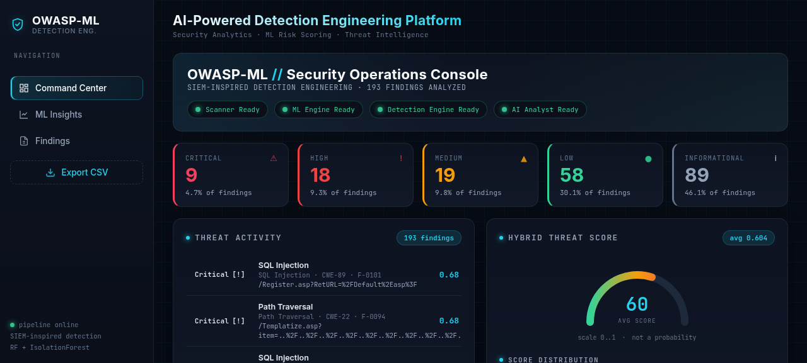

# OWASP-ML — SIEM-Inspired Detection Engineering & Security Analytics

### "Design of a Detection Engineering Model Using SIEM for Multi-Layered Attacks"




> Honest scope: this is a **SIEM-inspired detection-engineering and security-analytics platform**, not a full enterprise SIEM. It demonstrates vulnerability detection, rule-based detection, event correlation, ML risk prioritization, explainability and threat-intelligence reporting on top of OWASP ZAP findings — on a single workstation, with a bundled real scan so it runs end-to-end with zero external dependencies.

---

## 1. Problem

Web vulnerability scanners like OWASP ZAP produce hundreds of findings per scan, many of them
low-severity or duplicated. Raw scanner severity is a poor triage signal: it does not correlate
findings that hit the same endpoint, does not surface multi-vector attack chains, and does not
explain *why* one finding deserves attention before another. Analysts end up reading flat lists.

## 2. Solution

OWASP-ML adds a **detection-engineering and ML risk-prioritization layer** on top of ZAP:

- **Detection rules** (RULE-001..006) flag high-confidence injection, repeated high-risk endpoints, anomalous findings, etc.
- **Correlation engine** groups findings that share an endpoint into correlated security events — the "multi-layered attack" signal.
- **Hybrid ML model** (RandomForest + IsolationForest) produces an explainable *Hybrid Threat Score* per finding.
- **Conservative risk escalation** combines scanner risk + ML prediction + detection + correlation, never silently downgrading a serious finding and never inflating an Informational one.
- **AI analyst** turns the report into an executive summary with prioritized actions (rule-based fallback works fully offline).
- **SOC-style dashboard** visualizes everything: KPIs, threat activity feed, attack matrix, detection rules, correlation, ML insights.

## 3. Key Features

- Deterministic pipeline: `python run_pipeline.py --demo` (no ZAP, no API keys, no internet)
- Stable `finding_id` + content signature on every alert (traceability, no fragile positional joins)
- 6 transparent detection rules with auditable evidence
- SIEM-style endpoint correlation with a documented, capped scoring formula
- Hybrid Threat Score (0.6 × classifier + 0.3 × anomaly + 0.1 × static risk) — never called a "probability"
- Cross-target (leave-one-host-out) validation framework, honestly documented
- Structured remediation per attack class (why it matters / impact / fix / best practice)
- Dark SOC dashboard: command center, ML insights, findings table with detail drawer
- 4 JSON APIs (`/api/summary`, `/api/findings`, `/api/detections`, `/api/correlations`)
- 78 unit tests covering detection, correlation, NaN handling, malformed alerts, duplicates

## 4. Architecture

```
Target URL  ──or──  bundled demo scan
   │
   ▼
OWASP ZAP Scanner (spider + active scan + passive drain)     scanner/zap_scan.py
   │  (preflight: ZAP reachable, API key, target validity, authorization)
   ▼
Raw Alerts (JSON)  ────────────────────────────────────────  data/latest_scan.json
   │
   ▼
Preprocessing + Feature Engineering (finding_id + signature)  ml/alert_processor.py
   │  ── confidence, method, url/param/path features, hostname, https, special-chars
   ▼
Normalized Findings (CSV, stable finding_id)  ──────────────  data/processed_latest.csv
   │
   ├─▶ Detection Engine (RULE-001..006)                       detection/engine.py
   │      └─ detections.csv (detection_id, rule, evidence, finding_ids)
   │
   ├─▶ Correlation Engine (endpoint grouping, capped score)   detection/correlation.py
   │      └─ correlations.csv (correlation_id, members, attack types, score)
   │
   ├─▶ Hybrid ML Scoring (RandomForest + IsolationForest)     ml/hybrid_predict.py
   │      └─ classifier_confidence, anomaly_score, static_risk_weight, hybrid_threat_score
   │
   ▼
Risk Escalation (scanner + ML + detection + correlation)     ml/threat_intelligence.py
   │  conservative: never downgrades, never inflates Informational→Critical
   ▼
Threat Intelligence Report  ─────────────────────────────────  data/threat_report.csv
   │  (+ OWASP enrichment, explanation, structured remediation)
   ▼
AI Analyst (LLM optional, rule-based fallback)               ml/ai_analyst.py
   │  └─ ai_summary.json (executive summary + 3 priority actions)
   ▼
Flask SOC Dashboard                                          dashboard/app.py
   /  /ml-insights  /reports  + 4 JSON APIs
```

## 5. Detection Engineering

The detection layer is a lightweight, transparent SIEM-inspired engine — not a full SIEM.
Rules are declarative (`config/detection_rules.py`) and every detection carries auditable evidence.

| Rule | Scope | Severity | Fires when |
|---|---|---|---|
| RULE-001 | finding | Critical | SQL Injection reported with High scanner confidence |
| RULE-002 | group | High | ≥ 2 distinct injection classes on the same endpoint (injection chain) |
| RULE-003 | finding | High | Broken Authentication / Access Control with scanner risk ≥ Medium |
| RULE-004 | finding | Medium | Endpoint exposes query params AND carries an injection-class finding |
| RULE-005 | group | High | ≥ 2 High/Critical findings on the same endpoint |
| RULE-006 | finding | Medium | IsolationForest anomaly score > 0 (model-flagged anomalous) |

**Anti-inflation contract:** group rules attach **only to the relevant member findings** (e.g. RULE-005
flags only the High/Critical members, not Informational findings that happen to share the URL).
A detection imposes a *severity floor* on its findings — it can never downgrade.

## 6. Correlation Engine

Findings sharing an endpoint (host + path) are grouped into correlated events. The score is
transparent and capped:

```
correlation_score = related_findings_count
                  + severity_weight        (max risk index among members, 0..4)
                  + confidence_weight       (1 if any member is High confidence else 0)
                  capped at 10
```

Escalation is conservative: a correlated event escalates its members **only if** it is a true
multi-vector signal (≥ 2 distinct non-"Other" attack classes) **and** the member is already at
least Medium. A large but single-class endpoint group is *not* escalated — it is just noisy, not a
multi-layered attack. This prevents the "46 Informational findings become Critical" inflation bug.

## 7. ML Architecture

Two unsupervised/supervised components trained together (`ml/train_hybrid_model.py`):

- **RandomForestClassifier** — 200 trees, `max_depth=12`, `random_state=42`. Predicts the scanner
  risk class from engineered features.
- **IsolationForest** — 200 trees, `contamination=0.1`, `random_state=42`. Flags statistically
  unusual alerts.

Combined per finding in `ml/hybrid_predict.py`:

```
hybrid_threat_score = 0.6 × classifier_confidence
                    + 0.3 × anomaly_score
                    + 0.1 × static_risk_weight
```

> This is a **risk-prioritization score, not a calibrated probability.** It is displayed as
> "Hybrid Threat Score" and never as "ML confidence %". The four components are surfaced
> separately so the score is explainable.

**Features (24):** confidence, method, url_length, param_length, param_count, has_query_params,
path_depth, hostname_length, https_indicator, special_char_count, description_length,
solution_length, reference_count + 11 one-hot attack columns. CWE ids are **never** fed raw —
they are identifiers, not quantities (a raw CWE id would imply a fake ordering). Training and
inference build features through the **same** `ml/features.py` builder, so the feature space
cannot drift.

## 8. Hybrid Scoring & Risk Escalation

`Final_Risk` is computed conservatively in `ml/threat_intelligence.py::escalate_risk`:

1. `base = max(scanner_risk, ml_predicted_risk)` — ML never silently downgrades a scanner finding
2. `+1` if `hybrid_threat_score ≥ 0.75`, capped at Critical
3. floor to `detection_severity` (a Critical detection rule ⇒ at least Critical)
4. `+1` if the correlated event is a true multi-vector signal **and** the member is ≥ Medium

Missing/unknown signals are ignored, never inflated. The full ordering lives in one place:
`config/risks.py`.

## 9. AI Analyst

After the report is built, the AI analyst writes a 4–6 sentence executive summary + 3 prioritized
recommendations (`ml/ai_analyst.py`). It works with **any OpenAI-compatible endpoint** (OpenAI,
Groq, OpenRouter, local Ollama) via `.env`. No key configured → deterministic rule-based fallback.

The AI is an **explanation layer**: it summarizes evidence the deterministic pipeline already
produced. It **cannot** override `Final_Risk` — that is computed deterministically.

## 10. Dashboard

Dark SOC/cyberpunk "command center" theme (Flask + Chart.js):

- **`/` Command Center** — hero + system status, KPI cards, threat activity feed, Hybrid Threat
  Score gauge, AI analyst panel, risk/attack/OWASP charts, attack matrix heatmap, detection rules
  panel, correlation panel, top vulnerable endpoints
- **`/ml-insights`** — headline metrics, per-class performance, confusion matrix, feature
  importance, model architecture, cross-target validation, honesty disclaimer
- **`/reports`** — sortable + filterable findings table (severity / attack / OWASP / search) +
  detail drawer (risk calculation, explanation, structured remediation)
- **JSON APIs** — `/api/summary`, `/api/findings`, `/api/detections`, `/api/correlations`

## 11. Installation

```bash
git clone https://github.com/Kaif-Kenwey/OWASP-ML.git
cd OWASP-ML
pip install -r requirements.txt
```

Requires Python 3.11+. Dependencies: Flask, pandas, scikit-learn, joblib, requests,
python-dotenv, pytest.

## 12. Demo (no ZAP, no keys, no internet)

```bash
python run_pipeline.py --demo
python dashboard/app.py   # open http://127.0.0.1:5000
```

The bundled sample is a real ZAP scan (193 alerts from `testasp.vulnweb.com` +
`testaspnet.vulnweb.com`). Demo mode runs the **exact same** code path as a real scan:
preprocessing → training → hybrid scoring → detection → correlation → threat report → AI analyst.

Expected: 193 findings, ~94% classifier accuracy on the 49-alert holdout, 27 detection matches,
19 correlated events, final risk distribution ≈ 9 Critical / 18 High / 19 Medium / 58 Low /
89 Informational.

## 13. Authorized Real Scanning

```bash
# 1. Start ZAP in daemon mode with an API key
zap.sh -daemon -port 8080 -config api.key=<your-key>

# 2. Give the pipeline the same key + target
export ZAP_API_KEY=<your-key>
python run_pipeline.py https://your-authorized-target
```

The scanner runs a **preflight** (target URL valid, ZAP reachable, API key set, authorization
reminder) before sending any traffic. Spider / active-scan / passive-drain loops have **max-wait
safety caps** so a stalled ZAP cannot hang the pipeline.

## 14. Project Structure

```
OWASP-ML/
├── run_pipeline.py              # [1/8]..[8/8] stepper orchestrator
├── config/                      # single source of truth
│   ├── risks.py                 #   RISK_ORDER, weights, normalize_risk
│   ├── owasp_mapping.py         #   CWE→attack, attack→OWASP, descriptions
│   ├── detection_rules.py       #   RULE-001..006 declarative registry
│   ├── settings.py              #   thresholds, weights, random_state
│   └── clean.py                 #   NaN-safe value helpers
├── detection/
│   ├── engine.py                # rule evaluation + attach to findings
│   └── correlation.py           # endpoint grouping + capped score
├── scanner/zap_scan.py          # ZAP client: preflight + spider/active/passive + paginated alerts
├── ml/
│   ├── acquire_demo_data.py     # copy bundled sample → data/latest_scan.json
│   ├── alert_processor.py       # raw JSON → engineered features (finding_id + signature)
│   ├── encodings.py             # fixed encoding maps (train/inference parity)
│   ├── features.py              # shared feature builder
│   ├── train_hybrid_model.py    # RF + IF training, metrics, cross-target validation
│   ├── hybrid_predict.py        # 4 separated signals (classifier/anomaly/static/hybrid)
│   ├── scan_and_predict.py      # score alerts, carry finding_id
│   ├── threat_intelligence.py   # join on finding_id, detection, correlation, escalation
│   └── ai_analyst.py            # LLM summary + rule-based fallback
├── remediation/remedy_engine.py # structured why/impact/fix/best-practice per attack class
├── dashboard/
│   ├── app.py                   # Flask: 3 pages + 4 APIs + XTransformPort gateway support
│   ├── templates/               # base, dashboard, ml_insights, reports
│   └── static/                  # css/style.css (dark SOC) + js/dashboard.js
├── data/sample/latest_scan.json # bundled real scan (193 alerts) — powers demo mode
├── tests/                       # 78 tests (detection, correlation, NaN, malformed, dup)
├── docs/MAINTENANCE_GUIDE.md
├── MODEL_CARD.md
└── .github/workflows/ci.yml     # tests + demo + generated-file + NaN + dashboard checks
```

## 15. Model Evaluation

Trained on a 75/25 stratified holdout of the bundled scan (`random_state=42`, fully reproducible).
Metrics persisted to `models/training_metrics.json`:

| Class | Precision | Recall | F1 | Support |
|---|---|---|---|---|
| High | 1.000 | 1.000 | 1.000 | 3 |
| Informational | 1.000 | 0.913 | 0.955 | 23 |
| Low | 0.882 | 0.938 | 0.909 | 16 |
| Medium | 0.875 | 1.000 | 0.933 | 7 |
| **Accuracy** | | | **0.939** | 49 |
| Weighted F1 | | | 0.939 | |
| Macro F1 | | | 0.949 | |
| ROC-AUC (weighted OvR) | | | 0.999* | |

\* ROC-AUC is computed conditionally (≥ 2 classes, ≥ 20 test samples). On a 49-sample holdout
it is **indicative, not robust**.

**Cross-target (leave-one-host-out):** with the 2 hosts in the bundled scan —
train on testaspnet (14) → test on testasp (179): accuracy 0.36, weighted F1 0.53;
train on testasp (179) → test on testaspnet (14): accuracy 0.86, weighted F1 0.89.
The asymmetry is the honest signal: generalization is poor when training data is scarce.

## 16. Limitations

Stated plainly, because they matter:

1. **Small dataset** — 193 alerts from one scan. Enough to demonstrate the pipeline, not to claim
   generalization.
2. **Scanner-derived labels** — the classifier learns ZAP's own risk rating, not independent ground
   truth. If ZAP mis-rates something, the model is trained on the mis-rating.
3. **Single-target corpus** — all training data is one deliberately vulnerable ASP test site.
4. **Heavy "Other" class** — 91 of 193 alerts map to `Other` (CWE not in the tracked mapping).
5. **In-sample-ish evaluation** — the headline metrics are a random split of the same scan the
   model trains on, not a fresh scan of a different target.
6. **Not a substitute for manual pentesting** — it re-orders and explains scanner output; it does
   not find new vulnerabilities or verify exploits.

See [MODEL_CARD.md](MODEL_CARD.md) for the full, honest model documentation.

## 17. Future Work

- Add genuinely new labeled scans (authorized targets) to broaden the evidence base
- Deep-learning anomaly detector alongside the IsolationForest
- True SIEM event push (Splunk / ELK / Wazuh) — currently dashboard-only, not a real SIEM
- Real-time alerting + multi-target scheduled re-scans
- Calibrated probabilities (Platt scaling) if a verified label set becomes available
- Time-based correlation when ZAP timestamps are exposed

## 18. Ethical Use

Active scanning sends **real attack traffic** to the target. Only scan systems you own or have
**written permission** to test — a defined scope in writing, not a verbal okay. Unauthorized
scanning is illegal in most jurisdictions. The bundled demo data exists precisely so the project
can be evaluated without pointing it at anything you don't own.

## 19. Testing

```bash
python -m pytest tests/ -q          # 78 tests, no ZAP / no models needed
python run_pipeline.py --demo       # full pipeline smoke test
```

CI (`.github/workflows/ci.yml`) runs: unit tests → demo pipeline → generated-file verification →
critical-column NaN check → dashboard boot check on all routes + APIs.

## 20. Tech Stack

Python 3.11+ · Flask · pandas · scikit-learn · joblib · Chart.js · OWASP ZAP API · pytest

## 21. Author

**Mohammad Kaif** — B.Tech CSE (Data Science), Cybersecurity & AI Enthusiast

Thesis: *Design of a Detection Engineering Model Using SIEM for Multi-Layered Attacks*.

## Docs

- [MODEL_CARD.md](MODEL_CARD.md) — honest model documentation (data, metrics, leakage, bias, limitations)
- [docs/MAINTENANCE_GUIDE.md](docs/MAINTENANCE_GUIDE.md) — repo map, recipes, CI, adding a rule

## License

MIT — see [LICENSE](LICENSE).
